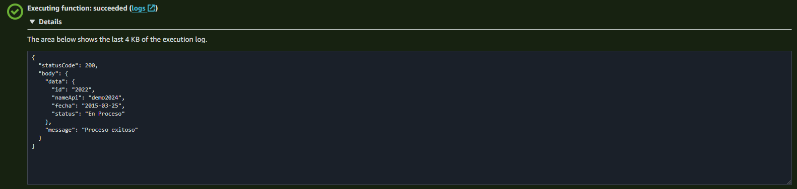
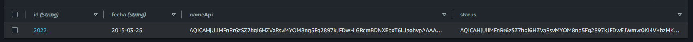

<a name="module-aws-dynamodb-kms"></a>

## aws-dynamodb-kms
Expone las funcionalidades relacionadas al servicio DynamoDB de AWS (getItem, putItem) usando cifrado de datos con kms.

**Lastmodified**: 2024-01-29 <br>
**Since**: 2024-01-24 <br>
**Version**: 1.2.0 <br>
**Author**: <jhonatan.valencia@pragma.com.co> <br>
**Example** <br>
```js
npm install dynamo_sdk
let dynamoDB = require('dynamo_sdk');
```

* [~getItem(tableName, key)](#module_dynamo_sdk..getItem) ⇒ <code>Promise</code>
* [~saveItem(tableName, item)](#module_dynamo_sdk..saveItem) ⇒ <code>Promise</code>

<a name="module_dynamo_sdk..getItem"></a>

### dynamo_sdk~getItem(tableName, key) ⇒ <code>Promise</code>
Permite obtener un item almacenado en una tabla en DynamoDB descifrando con kms los campos.

| Param | Type | Description |
| --- | --- | --- |
| tableName | <code>string</code> | Nombre de la tabla de la cual desea obtener el item |
| key | <code>object</code> | Clave asociada al item en la tabla de DynamoDB |

**Example**

**Evento de entrada a la lambda**
```js
const event = {
  "action": "get",
  "body": {
    "id": "2022"
  }
}
```

**Operaciones disponibles preconfiguradas (save, get)**
```js
const EncryptedDynamoDbClient = require ('./dynamo_sdk');

const TableName ="otp"
const events = {
  save: async ({body})=>{
      const paramsItem = {
        TableName,
        Item: {
          id: {
            S: body.id
          },
          status: {
            S: body.status
          },
          nameApi: {
            S: body.nameApi
          },
          fecha:{
            S: "2015-03-25"
          }
        }
      };
      return await EncryptedDynamoDbClient.saveItem(TableName, paramsItem.Item);
  },
  get: async ({body})=>{
    const itemToSearch = {
        id: {
          S: body.id
        },
        fecha:{
          S: "2015-03-25"
        }
    }
    return await EncryptedDynamoDbClient.getItem(TableName, itemToSearch);
  }
}
```


**Handler de la lambda**
```js
exports.handler = async (event, context) => {
    const eventValue = events[event.action]
    const response = await eventValue(event)
    return {
      statusCode: 200,
      body: {
        data: response,
        message: "Proceso exitoso"
      }
    }
};
```

**Ejemplo de ítem obtenido de DynamoDB**



<a name="module_dynamo_sdk..saveItem"></a>

### dynamo_sdk~saveItem(tableName, item) ⇒ <code>Promise</code>
Permite guardar un item en una tabla en DynamoDB cifrando con kms los campos.

| Param | Type | Description |
| --- | --- | --- |
| tableName | <code>string</code> | Nombre de la tabla en la cual desea guardar el item |
| item | <code>object</code> | Item a guardar en DynamoDB |

**Example**

**Evento de entrada a la lambda**
```js
const event = {
  "action": "save",
  "body": {
    "id": "2022",
    "nameApi": "demo2024",
    "status": "En Proceso"
  }
}
```

**Operaciones disponibles preconfiguradas (save, get)**
```js
const EncryptedDynamoDbClient = require ('./dynamo_sdk');

const TableName ="otp"
const events = {
  save: async ({body})=>{
      const paramsItem = {
        TableName,
        Item: {
          id: {
            S: body.id
          },
          status: {
            S: body.status
          },
          nameApi: {
            S: body.nameApi
          },
          fecha:{
            S: "2015-03-25"
          }
        }
      };
      return await EncryptedDynamoDbClient.saveItem(TableName, paramsItem.Item);
  },
  get: async ({body})=>{
    const itemToSearch = {
        id: {
          S: body.id
        },
        fecha:{
          S: "2015-03-25"
        }
    }
    return await EncryptedDynamoDbClient.getItem(TableName, itemToSearch);
  }
}
```


**Handler de la lambda**
```js
exports.handler = async (event, context) => {
    const eventValue = events[event.action]
    const response = await eventValue(event)
    return {
      statusCode: 200,
      body: {
        data: response,
        message: "Proceso exitoso"
      }
    }
};
```

**Ejemplo de ítem almacenado en DynamoDB**


